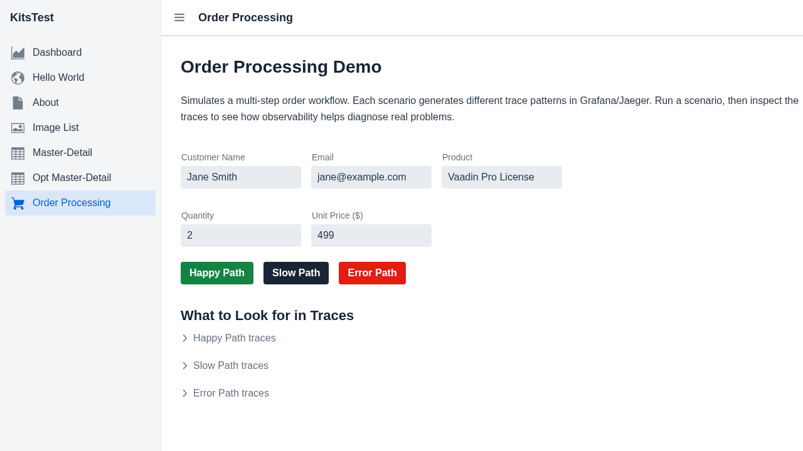
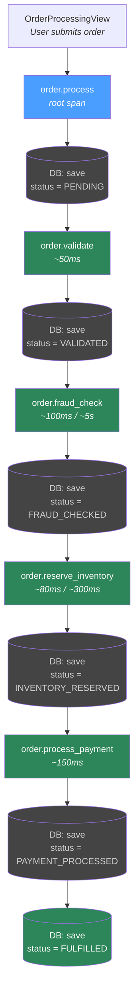
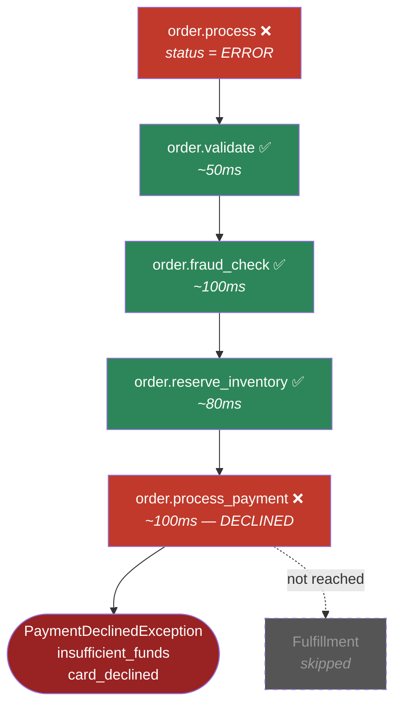

# Order Processing Demo — Trace Flow

The Order Processing view simulates a multi-step order workflow with three scenario buttons that each produce different trace patterns. This document describes the pipeline and the OpenTelemetry traces it produces across all three scenarios.

## Pipeline Overview

Each box with a green background is a `@WithSpan`-annotated method that creates an explicit OpenTelemetry span. The grey database nodes are auto-instrumented JPA operations (INSERT/UPDATE) that appear as child spans of the step that triggered them.

## Scenario: Happy Path (~480ms)

All steps succeed quickly. The resulting trace is a clean waterfall.

```mermaid
gantt
    title Happy Path Trace Waterfall
    dateFormat X
    axisFormat %Lms

    section order.process
    Root span                         :0, 480

    section   order.validate
    Validate order                    :0, 50

    section   order.fraud_check
    Check fraud (quick)               :50, 150

    section   order.reserve_inventory
    Reserve inventory                 :150, 230

    section   order.process_payment
    Process payment                   :230, 380

    section   DB (auto-instrumented)
    INSERT/UPDATE (status changes)    :milestone, 0, 0
```

**What to look for in Grafana:** A balanced waterfall where each step takes a proportional amount of time. All spans are green/OK. Between each step you'll see auto-instrumented JPA `INSERT` and `UPDATE` spans from the status persistence.

## Scenario: Slow Path (~6s)

The fraud check API times out and retries, and inventory uses an N+1 query pattern.

```mermaid
gantt
    title Slow Path Trace Waterfall
    dateFormat X
    axisFormat %Lms

    section order.process
    Root span                             :0, 6000

    section   order.validate
    Validate order                        :0, 50

    section   order.fraud_check
    Fraud check (total)                   :50, 5050

    section     fraud_check.call_api
    API call - TIMEOUT ⚠️                 :crit, 50, 3050

    section     fraud_check.retry
    Retry - succeeds                      :3050, 5050

    section   order.reserve_inventory
    Inventory (N+1 queries)               :5050, 5400

    section     DB queries (x10)
    Individual lookups (30ms each)        :5050, 5350

    section   order.process_payment
    Process payment                       :5400, 5600
```

**What to look for in Grafana:**
- The `fraud_check.call_api` child span dominates at ~3s and is marked **ERROR** with a `fraud.timeout` event
- The `fraud_check.retry` child span succeeds after ~2s
- The `order.reserve_inventory` span contains **many small DB query spans** — this is the N+1 anti-pattern, visible as a cascade of individual `SELECT` operations
- Total duration is ~6s vs ~480ms on the happy path

## Scenario: Error Path (~380ms)

Payment is declined. The pipeline stops and the order is marked as failed.

**What to look for in Grafana:**
- The `order.process_payment` span is marked **ERROR** with a recorded `PaymentDeclinedException`
- Span attributes show `payment.decline_reason = insufficient_funds` and `payment.error_code = card_declined`
- The parent `order.process` span also shows ERROR with `order.failure_step = Payment`
- The trace is **shorter** than the happy path because processing stops at the payment step
- This trace appears in both the **Traces** and **Errors** dashboard panels

## Span Attributes Reference

| Span | Key Attributes |
|------|----------------|
| `order.process` | `order.scenario`, `order.customer_name`, `order.product`, `order.quantity`, `order.total_amount`, `order.status`, `order.duration_ms`, `order.failure_step` (on error) |
| `order.validate` | `order.validation.result` |
| `order.fraud_check` | `fraud.provider`, `fraud.score`, `fraud.result`, `fraud.retry_count` (slow), `fraud.total_latency_ms` (slow) |
| `fraud_check.call_api` | `fraud.attempt`, `fraud.timeout` (slow — marked ERROR) |
| `fraud_check.retry` | `fraud.attempt`, `fraud.score`, `fraud.result` (slow) |
| `order.reserve_inventory` | `inventory.product`, `inventory.quantity_requested`, `inventory.warehouse`, `inventory.items_reserved`, `inventory.legacy_queries_executed` (slow) |
| `order.process_payment` | `payment.gateway`, `payment.amount`, `payment.currency`, `payment.transaction_id` (success), `payment.decline_reason` + `payment.error_code` (error) |
